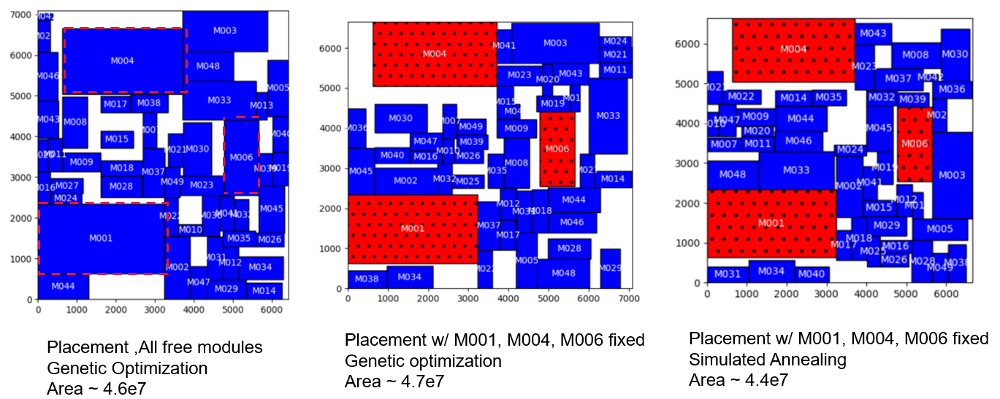

# Floorplanner

floor planner engine with sequence pair or other placement representations
current implementation is based on the paper:
[VLSI/PCB placement with obstacles based on sequence pair](https://ieeexplore.ieee.org/document/673633)

